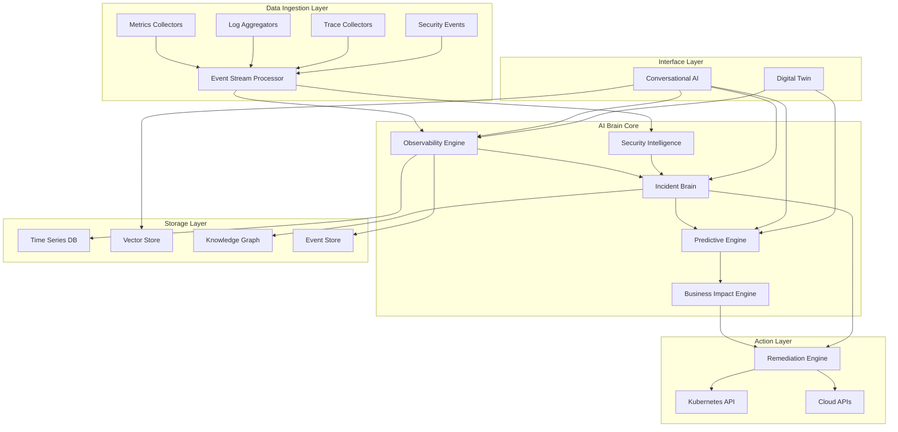

# VAJRA AI - System Design Document

## Overview

**VAJRA AI** (Virtual Autonomous Journey for Reliability & Availability) is an enterprise-grade AI platform that predicts failures, prevents outages, blocks bot attacks, and autonomously heals production systems - protecting millions in revenue for digital businesses. The platform unifies observability, AIOps, SecOps, bot protection, predictive AI, autonomous remediation, and digital twin simulation into a single AI-powered tool designed as a cloud-native, event-driven microservices architecture that can handle enterprise scale with 99.99% availability.

**Platform Positioning:**
- **AI-Powered Tool/Platform** - Not an operating system, but a sophisticated AI platform that runs on existing infrastructure
- **Enterprise-Grade** - Built for large organizations with demanding reliability requirements
- **Revenue Protection Focus** - Specifically designed to protect business revenue through superior system reliability
- **Autonomous Intelligence** - Combines human expertise with AI automation for optimal results

The platform serves as a unified AI Brain that ingests multi-signal data from production systems, applies machine learning models for analysis and prediction, and provides autonomous remediation capabilities with human oversight. The system is built on Kubernetes with cloud-agnostic deployment capabilities and enterprise-grade security controls.

## Feature Overview

### Core Platform Features

```
┌─────────────────────────────────────────────────────────────────────────────────┐
│                           VAJRA AI - Feature Matrix                            │
├─────────────────────────────────────────────────────────────────────────────────┤
│                                                                                 │
│  🧠 AI BRAIN CORE                    📊 OBSERVABILITY ENGINE                   │
│  ├─ Multi-Signal Correlation         ├─ Real-time Event Processing             │
│  ├─ Predictive Analytics             ├─ Anomaly Detection                       │
│  ├─ Root Cause Analysis              ├─ Cross-Service Correlation               │
│  └─ Autonomous Decision Making       └─ 90-Day Data Retention                  │
│                                                                                 │
│  🔒 SECURITY INTELLIGENCE            🚨 INCIDENT BRAIN                         │
│  ├─ Behavioral Analysis              ├─ 30-Second Root Cause Analysis          │
│  ├─ Bot Detection & Classification   ├─ Failure Chain Reconstruction           │
│  ├─ Threat Intelligence Feeds        ├─ Natural Language Explanations          │
│  └─ Attack Pattern Recognition       └─ Organizational Learning                │
│                                                                                 │
│  🔮 PREDICTIVE ENGINE                🛠️ REMEDIATION ENGINE                     │
│  ├─ 95% Accuracy Forecasting         ├─ Autonomous Healing                     │
│  ├─ Capacity Planning                ├─ Safety Boundary Enforcement            │
│  ├─ Seasonal Pattern Detection       ├─ Rollback Capabilities                  │
│  └─ Proactive Alerting               └─ Human Approval Workflows               │
│                                                                                 │
│  💼 BUSINESS IMPACT ENGINE           🗣️ CONVERSATIONAL AI                      │
│  ├─ Real-time Revenue Impact         ├─ Natural Language Queries               │
│  ├─ SLA Breach Quantification        ├─ Role-based Responses                   │
│  ├─ Executive Dashboards             ├─ Multi-turn Conversations               │
│  └─ Cost-Benefit Analysis            └─ Proactive Notifications                │
│                                                                                 │
│  🌐 DIGITAL TWIN                     ☁️ CLOUD-AGNOSTIC DEPLOYMENT             │
│  ├─ Production Topology Discovery    ├─ Kubernetes Native                      │
│  ├─ Real-time Synchronization        ├─ Multi-Cloud Support                    │
│  ├─ What-if Analysis                 ├─ Hybrid Deployments                     │
│  └─ Risk Modeling                    └─ Vendor Lock-in Prevention              │
│                                                                                 │
└─────────────────────────────────────────────────────────────────────────────────┘
```

### Feature Categories

#### 🎯 **Core Intelligence Features**

**1. Unified AI Brain**
```
    Production Systems → [Event Ingestion] → [AI Brain] → [Intelligent Actions]
                              ↓               ↓              ↓
                         • Metrics         • Correlation   • Remediation
                         • Logs            • Analysis      • Alerts  
                         • Traces          • Prediction    • Scaling
                         • Security Events • Learning      • Containment
```

**2. Multi-Signal Observability**
- **Real-time Processing**: Sub-second latency for 1M+ events/second
- **Cross-Signal Correlation**: Automatic pattern detection across metrics, logs, traces
- **Anomaly Detection**: ML-powered outlier identification with confidence scoring
- **Historical Analysis**: 90-day rolling window for trend analysis

**3. Predictive Analytics**
- **Forecasting Accuracy**: 95% accuracy over 7-day windows
- **Capacity Planning**: Resource saturation prediction with recommendations
- **Seasonal Adjustment**: Automatic pattern recognition and forecast adaptation
- **Proactive Alerting**: Early warning system with recommended actions

#### 🔍 **Incident Management Features**

**4. AI-Powered Incident Brain**
```
Incident Detection → Root Cause Analysis → Natural Language Explanation → Learning
       ↓                    ↓                        ↓                      ↓
   • Pattern Match      • Dependency Graph      • Evidence Summary     • Knowledge Base
   • Severity Score     • Timeline Analysis     • Action Recommendations • Pattern Storage
   • Auto-Escalation    • Causal Inference      • Stakeholder Alerts   • Prevention Tips
```

**5. Autonomous Remediation**
- **Safety-First Approach**: Configurable risk boundaries and approval gates
- **Rollback Capabilities**: Automatic reversal if conditions worsen
- **Learning System**: Continuous improvement from success/failure patterns
- **Multi-Environment Support**: Dev, staging, production with different policies

#### 🛡️ **Security & Compliance Features**

**6. Security Intelligence**
```
User Behavior → Baseline Creation → Anomaly Detection → Threat Classification
     ↓               ↓                    ↓                    ↓
• Activity Logs   • Statistical      • Pattern Matching   • Risk Assessment
• API Calls       • Modeling         • ML Detection       • Auto-Response
• Access Patterns • Behavioral       • Correlation        • Containment
• Network Traffic • Profiling        • Attribution        • Reporting
```

**7. Enterprise Security Controls**
- **Zero-Trust Architecture**: End-to-end encryption for all data
- **Role-Based Access Control**: Fine-grained permissions with MFA
- **Compliance Reporting**: SOC2, ISO27001, GDPR automated reporting
- **Audit Trails**: Comprehensive logging for all user actions

#### 💰 **Business Intelligence Features**

**8. Business Impact Engine**
```
Technical Incident → Service Mapping → Revenue Calculation → Executive Dashboard
        ↓                ↓                  ↓                    ↓
   • Service Down    • Business Context  • Customer Impact   • Real-time KPIs
   • Performance     • Revenue Mapping   • SLA Breaches      • Cost Analysis
   • Degradation     • Criticality       • Financial Loss    • Trend Reports
   • Security Event • Dependencies      • Contractual Risk  • Recommendations
```

**9. Financial Modeling**
- **Real-time Revenue Impact**: Instant calculation during incidents
- **SLA Breach Quantification**: Customer impact and contractual exposure
- **Cost-Benefit Analysis**: ROI modeling for remediation strategies
- **Executive Reporting**: Business-relevant metrics and KPIs

#### 🤖 **AI & Automation Features**

**10. Conversational AI Interface**
```
Natural Language Query → Intent Recognition → Context Processing → Personalized Response
         ↓                      ↓                   ↓                    ↓
    • Plain English         • Entity Extraction  • Role Awareness    • Summary View
    • Voice Commands        • Multi-turn Context • Permission Check  • Detailed Analysis
    • Chat Interface        • Domain Knowledge   • Conversation      • Action Suggestions
    • Mobile Support        • Technical Terms    • Memory            • Proactive Alerts
```

**11. Digital Twin Simulation**
- **Production Mirroring**: Real-time topology discovery and mapping
- **What-if Analysis**: Impact simulation for proposed changes
- **Risk Modeling**: Cascade effect prediction with blast radius calculation
- **Confidence Scoring**: Uncertainty quantification for all simulations

#### 🌐 **Platform & Integration Features**

**12. Cloud-Agnostic Deployment**
```
    AWS ←→ [SRE GPT OS] ←→ Azure ←→ GCP ←→ On-Premises
           ↓
    • Kubernetes Native
    • Standardized APIs
    • Data Portability
    • Unified Management
    • Cost Optimization
```

**13. Enterprise Scale & Performance**
- **High Availability**: 99.99% uptime with automated failover
- **Horizontal Scaling**: Linear performance improvements
- **Multi-Region Support**: Consistent performance across regions
- **Auto-Scaling**: Dynamic resource allocation based on demand

### Visual Feature Architecture

```
                    ┌─────────────────────────────────────────┐
                    │           USER INTERFACES               │
                    │  🖥️ Web Dashboard  📱 Mobile  🗣️ Voice  │
                    └─────────────────┬───────────────────────┘
                                      │
                    ┌─────────────────┴───────────────────────┐
                    │         CONVERSATIONAL AI LAYER        │
                    │   Natural Language Processing & RAG     │
                    └─────────────────┬───────────────────────┘
                                      │
        ┌─────────────────────────────┼─────────────────────────────┐
        │                             │                             │
┌───────┴────────┐          ┌────────┴────────┐          ┌────────┴────────┐
│   AI BRAIN     │          │  DIGITAL TWIN   │          │ BUSINESS IMPACT │
│   CORE         │          │   SIMULATION    │          │    ENGINE       │
│                │          │                 │          │                 │
│ • Correlation  │          │ • Topology      │          │ • Revenue       │
│ • Prediction   │          │ • What-if       │          │ • SLA Tracking  │
│ • Learning     │          │ • Risk Model    │          │ • Executive     │
└───────┬────────┘          └────────┬────────┘          └────────┬────────┘
        │                            │                            │
        └─────────────────┬──────────┴──────────┬─────────────────┘
                          │                     │
                ┌─────────┴────────┐  ┌────────┴────────┐
                │  OBSERVABILITY   │  │   SECURITY      │
                │     ENGINE       │  │ INTELLIGENCE    │
                │                  │  │                 │
                │ • Event Stream   │  │ • Behavior      │
                │ • Anomaly Det.   │  │ • Threat Det.   │
                │ • Correlation    │  │ • Bot Class.    │
                └─────────┬────────┘  └────────┬────────┘
                          │                    │
                          └─────────┬──────────┘
                                    │
                          ┌─────────┴────────┐
                          │   REMEDIATION    │
                          │     ENGINE       │
                          │                  │
                          │ • Auto Healing   │
                          │ • Safety Gates   │
                          │ • Rollback       │
                          └──────────────────┘
```

### Key Differentiators

#### 🚀 **Innovation Highlights**

1. **Unified AI Brain**: Single intelligence layer across all operational domains
2. **30-Second Root Cause Analysis**: Fastest incident resolution in the industry
3. **95% Prediction Accuracy**: Industry-leading forecasting capabilities
4. **GOD MODE Digital Twin**: Complete production environment simulation
5. **Conversational Operations**: Natural language interface for all functions
6. **Autonomous Remediation**: Self-healing systems with human oversight
7. **Real-time Business Impact**: Instant revenue and SLA impact calculation

#### 📈 **Enterprise Value Proposition**

```
Traditional Approach          →          VAJRA AI Approach
─────────────────────────────────────────────────────────────────
Multiple Tools & Dashboards   →   Single Unified AI Platform
Manual Incident Analysis       →   30-Second Automated RCA
Reactive Problem Solving       →   Predictive Prevention
Siloed Security Operations     →   Integrated Threat Intelligence
Complex Multi-Tool Training    →   Natural Language Interface
High MTTR (Hours)             →   Low MTTR (Minutes)
Limited Business Context      →   Real-time Revenue Impact
Vendor Lock-in                →   Cloud-Agnostic Deployment
```

This comprehensive feature set positions VAJRA AI as the next-generation platform for enterprise production operations, combining cutting-edge AI with practical operational needs.

## Architecture

### High-Level Architecture



### Microservices Architecture

The system is composed of the following core microservices:

1. **Event Stream Processor**: High-throughput event ingestion and routing
2. **Observability Engine**: Multi-signal correlation and anomaly detection
3. **Incident Brain**: Root cause analysis and incident management
4. **Predictive Engine**: Time series forecasting and failure prediction
5. **Security Intelligence**: Threat detection and behavioral analysis
6. **Remediation Engine**: Autonomous healing and response orchestration
7. **Business Impact Engine**: Revenue and SLA impact modeling
8. **Conversational AI**: Natural language processing and response generation
9. **Digital Twin**: Topology discovery and simulation engine
10. **Knowledge Graph Service**: Service dependency mapping and relationship management
11. **Vector Store Service**: Embedding storage and similarity search
12. **Authentication & Authorization Service**: Enterprise security and access control

### Event-Driven Communication

All microservices communicate through an event-driven architecture using Apache Kafka as the message broker. This ensures loose coupling, scalability, and fault tolerance.

**Event Categories:**
- **System Events**: Metrics, logs, traces, alerts
- **Security Events**: Authentication, authorization, threat detection
- **Incident Events**: Detection, analysis, resolution
- **Remediation Events**: Action triggers, execution status, outcomes
- **Business Events**: Impact calculations, SLA breaches

## Components and Interfaces

### Event Stream Processor

**Purpose**: High-throughput ingestion and initial processing of all system events.

**Key Interfaces**:
- REST API for batch event submission
- gRPC streaming API for real-time event ingestion
- Kafka producer for event distribution
- Prometheus metrics endpoint

**Core Functions**:
- Event validation and normalization
- Rate limiting and backpressure handling
- Event routing based on type and priority
- Dead letter queue management for failed events

### Observability Engine

**Purpose**: Multi-signal correlation, anomaly detection, and pattern recognition.

**Key Interfaces**:
- Kafka consumer for event streams
- REST API for query and configuration
- gRPC API for real-time anomaly notifications
- Time series database connector

**Core Functions**:
- Real-time anomaly detection using statistical and ML models
- Cross-signal correlation with configurable time windows
- Pattern matching against historical incident signatures
- Confidence scoring for detected anomalies

**ML Models**:
- Isolation Forest for outlier detection
- LSTM networks for time series anomaly detection
- Graph neural networks for service dependency analysis

### Incident Brain

**Purpose**: Automated root cause analysis, incident management, and organizational learning.

**Key Interfaces**:
- REST API for incident management
- GraphQL API for complex incident queries
- Webhook endpoints for external integrations
- Knowledge graph database connector

**Core Functions**:
- Automated root cause analysis using causal inference
- Failure chain reconstruction from event timelines
- Natural language explanation generation
- Incident knowledge extraction and storage

**AI Capabilities**:
- Causal discovery algorithms for root cause identification
- Large language models for explanation generation
- Reinforcement learning for incident response optimization

### Predictive Engine

**Purpose**: Time series forecasting, capacity planning, and proactive failure detection.

**Key Interfaces**:
- REST API for forecast requests
- Streaming API for real-time predictions
- Batch processing API for large-scale analysis
- Model management interface

**Core Functions**:
- Multi-horizon time series forecasting
- Anomaly prediction with confidence intervals
- Capacity saturation modeling
- Seasonal pattern detection and adjustment

**ML Models**:
- Prophet for seasonal time series forecasting
- ARIMA models for short-term predictions
- Neural networks for complex pattern recognition
- Ensemble methods for improved accuracy

### Security Intelligence

**Purpose**: Behavioral modeling, threat detection, and security event correlation.

**Key Interfaces**:
- REST API for security queries
- Real-time threat feed integration
- SIEM integration endpoints
- Behavioral analytics dashboard

**Core Functions**:
- User and entity behavior analytics (UEBA)
- Bot detection and classification
- Threat intelligence correlation
- Attack pattern recognition

**Security Models**:
- Behavioral baselines using statistical modeling
- Graph-based attack detection
- Deep learning for bot classification
- Threat intelligence matching algorithms

### Remediation Engine

**Purpose**: Autonomous healing, scaling, and security response with human oversight.

**Key Interfaces**:
- REST API for remediation policies
- Kubernetes API integration
- Cloud provider API connectors
- Approval workflow endpoints

**Core Functions**:
- Policy-based remediation action selection
- Safety boundary enforcement
- Rollback capability for failed actions
- Human approval workflows for high-risk actions

**Safety Mechanisms**:
- Circuit breakers for remediation actions
- Blast radius calculation and limiting
- Approval gates based on risk assessment
- Comprehensive action logging and audit trails

### Business Impact Engine

**Purpose**: Revenue impact modeling, SLA tracking, and business context integration.

**Key Interfaces**:
- REST API for impact calculations
- Business metrics dashboard
- SLA monitoring endpoints
- Financial modeling interface

**Core Functions**:
- Real-time revenue impact calculation
- SLA breach detection and quantification
- Business context mapping maintenance
- Cost-benefit analysis for remediation actions

### Conversational AI Layer

**Purpose**: Natural language interface with role-based responses and multi-turn conversations.

**Key Interfaces**:
- WebSocket API for real-time chat
- REST API for query processing
- Voice interface integration
- Mobile app API endpoints

**Core Functions**:
- Intent recognition and entity extraction
- Context-aware response generation
- Role-based information filtering
- Multi-turn conversation management

**AI Components**:
- Large language models for natural language understanding
- Retrieval-augmented generation (RAG) for accurate responses
- Vector embeddings for semantic search
- Fine-tuned models for domain-specific queries

### Digital Twin Engine

**Purpose**: Production topology discovery, simulation, and risk modeling.

**Key Interfaces**:
- REST API for topology queries
- Simulation execution endpoints
- What-if analysis interface
- Topology visualization API

**Core Functions**:
- Automated service discovery and mapping
- Real-time topology synchronization
- Failure scenario simulation
- Impact prediction and blast radius calculation

**Simulation Capabilities**:
- Discrete event simulation for system behavior
- Monte Carlo methods for uncertainty quantification
- Graph algorithms for dependency analysis
- Performance modeling and capacity simulation

## Data Models

### Event Schema

```json
{
  "eventId": "uuid",
  "timestamp": "iso8601",
  "source": "string",
  "type": "enum[metric, log, trace, alert, security]",
  "severity": "enum[low, medium, high, critical]",
  "service": "string",
  "environment": "string",
  "data": "object",
  "metadata": {
    "tags": "object",
    "correlationId": "string",
    "traceId": "string"
  }
}
```

### Incident Schema

```json
{
  "incidentId": "uuid",
  "title": "string",
  "description": "string",
  "severity": "enum[low, medium, high, critical]",
  "status": "enum[open, investigating, resolved, closed]",
  "createdAt": "iso8601",
  "updatedAt": "iso8601",
  "rootCause": {
    "service": "string",
    "component": "string",
    "cause": "string",
    "confidence": "float"
  },
  "timeline": [
    {
      "timestamp": "iso8601",
      "event": "string",
      "source": "string"
    }
  ],
  "businessImpact": {
    "revenueImpact": "float",
    "customersAffected": "integer",
    "slaBreaches": "array"
  }
}
```

### Service Topology Schema

```json
{
  "serviceId": "string",
  "name": "string",
  "type": "enum[api, database, queue, cache, external]",
  "environment": "string",
  "dependencies": [
    {
      "serviceId": "string",
      "type": "enum[sync, async, data]",
      "criticality": "enum[low, medium, high, critical]"
    }
  ],
  "metrics": {
    "availability": "float",
    "latency": "object",
    "throughput": "float",
    "errorRate": "float"
  },
  "businessContext": {
    "criticality": "enum[low, medium, high, critical]",
    "revenueImpact": "float",
    "customerFacing": "boolean"
  }
}
```

### Remediation Action Schema

```json
{
  "actionId": "uuid",
  "type": "enum[scale, restart, rollback, isolate, patch]",
  "target": {
    "service": "string",
    "component": "string",
    "environment": "string"
  },
  "parameters": "object",
  "riskLevel": "enum[low, medium, high, critical]",
  "approvalRequired": "boolean",
  "rollbackPlan": "object",
  "expectedOutcome": "string",
  "safetyChecks": ["string"]
}
```

## Correctness Properties

*A property is a characteristic or behavior that should hold true across all valid executions of a system—essentially, a formal statement about what the system should do. Properties serve as the bridge between human-readable specifications and machine-verifiable correctness guarantees.*

Before defining the correctness properties, I need to analyze the acceptance criteria to determine which ones are testable as properties, examples, or edge cases.

### Property Reflection

After analyzing all acceptance criteria, I identified several areas where properties can be consolidated to eliminate redundancy:

- Event processing properties can be combined into comprehensive event handling validation
- Incident management properties can be consolidated into unified incident response validation  
- Prediction and alerting properties can be merged into forecasting accuracy validation
- Security detection properties can be combined into comprehensive threat response validation
- Remediation properties can be consolidated into autonomous action validation
- Business impact properties can be merged into comprehensive impact modeling validation
- Conversational properties can be combined into unified response generation validation
- Digital twin properties can be consolidated into simulation accuracy validation
- Security implementation properties can be merged into comprehensive security compliance validation
- Performance properties can be combined into scalability and availability validation
- Cloud properties can be consolidated into portability and abstraction validation
- AI model properties can be merged into comprehensive model lifecycle validation

### Correctness Properties

Property 1: **Event Processing Latency and Correlation**
*For any* event stream with mixed signal types (metrics, logs, traces, security events), the Observability Engine should process all events with sub-second latency while maintaining correlation accuracy across time windows and service boundaries with confidence scores based on historical patterns.
**Validates: Requirements 1.1, 1.2, 1.3, 1.5**

Property 2: **Data Retention and Escalation**
*For any* event pattern matching known incident signatures, the system should automatically escalate to the Incident Brain while maintaining a rolling 90-day window of high-resolution data for analysis.
**Validates: Requirements 1.5, 1.6**

Property 3: **Incident Analysis and Learning**
*For any* detected incident, the Incident Brain should perform root cause analysis within 30 seconds, reconstruct failure chains from dependency graphs and timelines, generate natural language explanations, and extract learnings that update the knowledge base automatically.
**Validates: Requirements 2.1, 2.2, 2.3, 2.4, 2.6**

Property 4: **Proactive Pattern Detection**
*For any* incident pattern that has occurred previously, the system should proactively alert with prevention recommendations when similar patterns emerge.
**Validates: Requirements 2.5**

Property 5: **Prediction Accuracy and Alerting**
*For any* time series data, the Predictive Engine should forecast resource saturation with 95% accuracy over 7-day windows, generate proactive alerts when failure probability exceeds thresholds, and provide confidence intervals with uncertainty quantification for all predictions.
**Validates: Requirements 3.1, 3.2, 3.5**

Property 6: **Adaptive Learning and Seasonal Adjustment**
*For any* historical pattern data, the Predictive Engine should continuously improve accuracy through learning and adjust forecasts when seasonal patterns are detected, while recommending optimal scaling strategies for predicted capacity constraints.
**Validates: Requirements 3.3, 3.4, 3.6**

Property 7: **Security Behavioral Analysis**
*For any* user behavior and bot traffic, the Security Intelligence should build behavioral baselines, detect anomalous patterns, classify bot types with threat levels, and correlate security events across multiple data sources and time windows.
**Validates: Requirements 4.1, 4.2, 4.3**

Property 8: **Automated Security Response**
*For any* identified attack pattern, the Security Intelligence should automatically trigger appropriate countermeasures while maintaining threat intelligence feeds and providing attribution analysis with impact assessment for security incidents.
**Validates: Requirements 4.4, 4.5, 4.6**

Property 9: **Safe Remediation Execution**
*For any* detected failure condition, the Remediation Engine should execute appropriate actions within defined safety boundaries, monitor outcomes with rollback capability if conditions worsen, and learn from all attempts to improve future actions.
**Validates: Requirements 5.1, 5.2, 5.3**

Property 10: **Risk-Based Remediation Control**
*For any* remediation action, the system should require human approval for high-risk actions based on configurable policies, automatically implement containment for confirmed security threats, and optimize scaling decisions for both performance and cost efficiency.
**Validates: Requirements 5.4, 5.5, 5.6**

Property 11: **Real-Time Business Impact Calculation**
*For any* incident or SLA breach, the Business Impact Engine should calculate real-time revenue impact based on service criticality and user traffic, quantify customer impact and contractual exposure, and maintain accurate business context mappings.
**Validates: Requirements 6.1, 6.2, 6.3**

Property 12: **Business Analysis and Reporting**
*For any* risk scenario or capacity planning decision, the Business Impact Engine should provide cost-benefit analysis for mitigation strategies, generate executive dashboards with business-relevant metrics, and model financial implications.
**Validates: Requirements 6.4, 6.5, 6.6**

Property 13: **Conversational Intelligence**
*For any* natural language query, the Conversational Layer should interpret intent and provide relevant responses tailored to user roles and permissions, support multi-turn conversations with context retention, and provide both summary and detailed views based on user preference.
**Validates: Requirements 7.1, 7.2, 7.3, 7.4**

Property 14: **Unified Platform Access and Notifications**
*For any* system component and urgent situation, the Conversational Layer should provide unified access to all platform capabilities and proactively notify relevant stakeholders with appropriate urgency levels.
**Validates: Requirements 7.5, 7.6**

Property 15: **Digital Twin Synchronization and Discovery**
*For any* production system, the Digital Twin should automatically discover and map service topologies with dependencies while maintaining real-time synchronization with topology changes.
**Validates: Requirements 8.1, 8.3**

Property 16: **Simulation and Impact Prediction**
*For any* proposed change or failure scenario, the Digital Twin should simulate impact on system behavior and performance, predict cascade effects and blast radius, support what-if analysis, and provide confidence levels with uncertainty bounds for all simulation results.
**Validates: Requirements 8.2, 8.4, 8.5, 8.6**

Property 17: **Comprehensive Security Implementation**
*For any* data in transit or at rest, the system should implement zero-trust architecture with end-to-end encryption, maintain comprehensive audit trails for all user actions, and implement data classification with protection policies for sensitive data.
**Validates: Requirements 9.1, 9.2, 9.4**

Property 18: **Security Controls and Compliance**
*For any* access request and security vulnerability, the system should enforce role-based access control with fine-grained permissions and multi-factor authentication, provide compliance reporting for SOC2/ISO27001/GDPR, and implement automated patching with vulnerability management.
**Validates: Requirements 9.3, 9.5, 9.6**

Property 19: **Enterprise Scale and Availability**
*For any* deployment configuration, the system should maintain 99.99% availability with automated failover, provide consistent performance and data synchronization across multiple regions, support horizontal scaling with linear performance improvements, and automatically scale infrastructure when resource utilization exceeds thresholds.
**Validates: Requirements 10.3, 10.4, 10.5, 10.6**

Property 20: **Cloud Portability and Abstraction**
*For any* cloud provider (AWS, Azure, GCP, on-premises), the system should deploy successfully on Kubernetes clusters, maintain data portability and configuration consistency during migrations, abstract cloud-specific services through standardized interfaces, and provide fallback implementations for cross-cloud compatibility.
**Validates: Requirements 11.1, 11.2, 11.3, 11.4**

Property 21: **Multi-Cloud Optimization**
*For any* hybrid or multi-cloud deployment, the system should provide unified management and optimize resource provisioning for both cost and performance across providers.
**Validates: Requirements 11.5, 11.6**

Property 22: **AI Model Lifecycle Management**
*For any* AI model deployment, the system should support orchestration of multiple models with different frameworks and versions, utilize vector embeddings and RAG for query processing, maintain efficient vector stores with similarity search, and support A/B testing with gradual rollout strategies for model updates.
**Validates: Requirements 12.1, 12.2, 12.3, 12.4**

Property 23: **AI Model Performance and Knowledge Management**
*For any* deployed AI model and knowledge base update, the system should provide performance monitoring with automatic retraining capabilities and automatically refresh vector embeddings with model contexts when knowledge bases are updated.
**Validates: Requirements 12.5, 12.6**

## Error Handling

### Error Categories and Strategies

**1. Data Ingestion Errors**
- **Malformed Events**: Validate event schema and route invalid events to dead letter queue
- **Rate Limiting**: Implement backpressure mechanisms and circuit breakers
- **Source Unavailability**: Maintain event buffers and retry with exponential backoff

**2. AI Model Errors**
- **Model Failures**: Implement model fallbacks and graceful degradation
- **Prediction Errors**: Provide confidence intervals and uncertainty quantification
- **Training Failures**: Maintain model versioning and rollback capabilities

**3. Remediation Errors**
- **Action Failures**: Implement comprehensive rollback mechanisms
- **Safety Violations**: Enforce circuit breakers and approval gates
- **Resource Constraints**: Queue actions and implement priority-based execution

**4. Infrastructure Errors**
- **Service Failures**: Implement health checks and automatic failover
- **Network Partitions**: Use eventual consistency and conflict resolution
- **Storage Failures**: Maintain data replication and backup strategies

**5. Security Errors**
- **Authentication Failures**: Implement account lockout and audit logging
- **Authorization Violations**: Log violations and alert security teams
- **Data Breaches**: Implement automatic containment and notification procedures

### Error Recovery Patterns

**Circuit Breaker Pattern**: Prevent cascade failures by temporarily disabling failing services
**Bulkhead Pattern**: Isolate critical resources to prevent resource exhaustion
**Timeout Pattern**: Prevent resource blocking with configurable timeouts
**Retry Pattern**: Implement exponential backoff with jitter for transient failures
**Fallback Pattern**: Provide alternative responses when primary services fail

## Testing Strategy

### Dual Testing Approach

The VAJRA AI requires both unit testing and property-based testing to ensure comprehensive coverage:

**Unit Tests**: Focus on specific examples, edge cases, and error conditions
- Integration points between microservices
- Error handling scenarios and edge cases
- Specific business logic implementations
- API contract validation

**Property Tests**: Verify universal properties across all inputs
- Event processing latency and correlation accuracy
- Prediction accuracy across different time series patterns
- Security detection across various attack patterns
- Remediation safety across different failure scenarios

### Property-Based Testing Configuration

**Testing Framework**: Use Hypothesis (Python) or fast-check (TypeScript) for property-based testing
**Test Configuration**: Minimum 1000 iterations per property test due to the critical nature of the system
**Test Tagging**: Each property test must reference its design document property

**Tag Format**: 
```
Feature: vajra-ai, Property 1: Event Processing Latency and Correlation
Feature: vajra-ai, Property 2: Data Retention and Escalation
```

### Testing Priorities

**Critical Path Testing**:
1. Event ingestion and processing pipeline
2. Incident detection and root cause analysis
3. Autonomous remediation safety mechanisms
4. Security threat detection and response
5. Business impact calculation accuracy

**Performance Testing**:
- Load testing for 1M+ events per second
- Latency testing for sub-second response requirements
- Scalability testing for 1000+ service monitoring
- Availability testing for 99.99% uptime requirements

**Security Testing**:
- Penetration testing for threat detection capabilities
- Compliance testing for SOC2/ISO27001/GDPR requirements
- Authentication and authorization testing
- Data encryption and protection validation

**Integration Testing**:
- End-to-end workflow testing across all components
- Multi-cloud deployment and migration testing
- AI model integration and performance testing
- Digital twin simulation accuracy testing

### Test Data Management

**Synthetic Data Generation**: Create realistic production-like data for testing
**Data Privacy**: Ensure test data complies with privacy regulations
**Test Environment Isolation**: Maintain separate environments for different test types
**Continuous Testing**: Implement automated testing in CI/CD pipelines

The testing strategy ensures that each correctness property is validated through comprehensive property-based tests while unit tests handle specific scenarios and edge cases. This dual approach provides confidence in the system's reliability at enterprise scale.